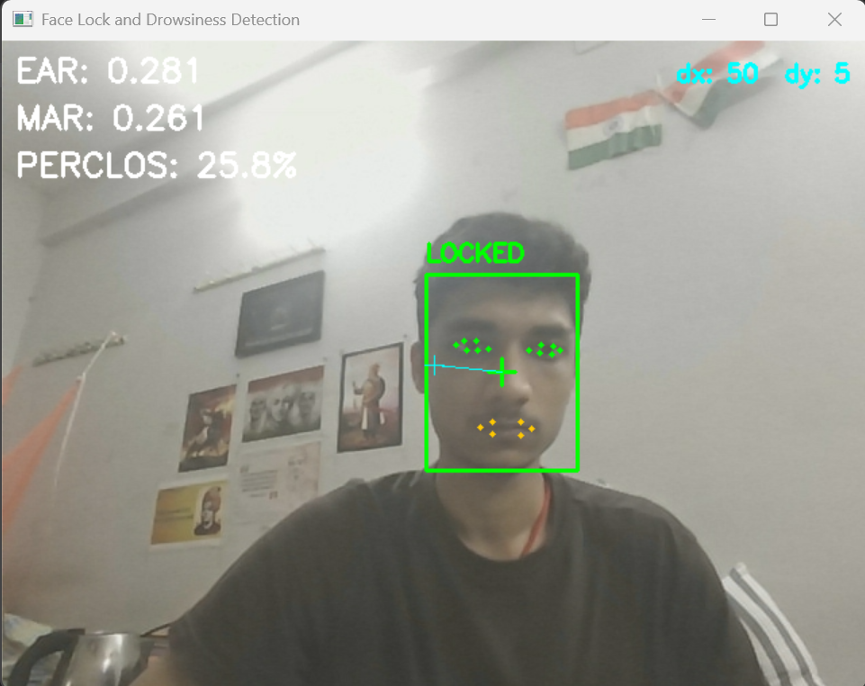

# Driver Drowsiness Detection System


A real-time drowsiness and yawn detection system that combines **YOLO face detection** (for locking onto a single face in the frame) with **MediaPipe Face Mesh** (for fine-grained landmark tracking) to compute **EAR (Eye Aspect Ratio)**, **MAR (Mouth Aspect Ratio)**, and **PERCLOS (Percentage of Eye Closure)** — the three core signals used to flag closed eyes, yawning, and sustained drowsiness.

---

## Table of Contents

- [Tech Stack](#tech-stack)
- [Output Screenshots](#output-screenshots)
- [Overview](#overview)
- [Architecture](#architecture)
- [Directory Structure](#directory-structure)
- [File-by-File Reference](#file-by-file-reference)
- [Core Pipeline Explained](#core-pipeline-explained)
  - [1. Face Detection & Locking (`detector.py`)](#1-face-detection--locking-detectorpy)
  - [2. Landmark Processing (`drowsiness_detector.py`)](#2-landmark-processing-drowsiness_detectorpy)
  - [3. On-Screen Info Rendering (`DisplayINFO.py`)](#3-on-screen-info-rendering-displayinfopy)
- [Metrics Explained (EAR / MAR / PERCLOS)](#metrics-explained-ear--mar--perclos)
- [Installation](#installation)
- [Usage](#usage)
- [Output Screenshots](#output-screenshots)
- [Configuration / Tuning Thresholds](#configuration--tuning-thresholds)
- [Known Issues / Notes](#known-issues--notes)
- [Roadmap](#roadmap)

---

## Tech Stack

**Language**

| Badge | Used for |
|---|---|
|  | Entire project — detection loop, math, rendering |

**Core Libraries / Modules**

| Badge | Role in this project |
|---|---|
|  | Webcam capture (`cv.VideoCapture`), all drawing (boxes, text, markers, dots), color conversion (BGR↔RGB), display window (`cv.imshow`) |
|  | `FaceMesh` solution — extracts 468 facial landmarks used to compute EAR and MAR |
|  | Face detection model wrapper — runs inference with the custom `yolo26n-face.pt` weights to locate face bounding boxes |
|  | Vector math for EAR/MAR — Euclidean distance (`np.linalg.norm`) between landmark points |
|  | Required by MediaPipe internally; pinned to this exact version to avoid ABI conflicts with newer protobuf releases |
| `collections.deque` | Python standard library — backs the rolling 60-second PERCLOS window (`update_perclos`) |
| `time` | Python standard library — timestamps each frame for the PERCLOS rolling window |

**Project Tags**


**Custom Assets**

| Asset | Role |
|---|---|
| `model/yolo26n-face.pt` | Fine-tuned YOLO checkpoint specialized for face detection (not a stock YOLO model) |

---

## Output Screenshots

The system produces three distinct visual states depending on driver behavior. Add your captured screenshots below.

### 1. Face Detection / Lock (normal, alert state)
Shows the green "LOCKED" bounding box, center crosshair, dx/dy offset, and EAR/MAR/PERCLOS readout with no alerts active.

<!--  -->


---

### 2. Eyes Closed Detection
Shows the "EYES CLOSED" red label triggering when EAR drops below `0.21`. If sustained long enough, this is also where you'd capture the rolling PERCLOS % climbing and the "DROWSINESS ALERT" banner appearing.

<!--  -->
`📸 Add screenshot here`

---

### 3. Yawning Detection
Shows the "YAWNING" orange label triggering when MAR exceeds `0.6`, with the mouth landmark dots visibly spread around the open mouth.

<!--  -->
`📸 Add screenshot here`

---

## Overview

The system runs entirely on a live webcam feed and performs the following loop, frame by frame:

1. **Detect** all faces in the frame using a fine-tuned YOLO face model.
2. **Lock** onto the single largest/most prominent face (so the system tracks one driver even if other faces appear in the background).
3. **Crop** the frame to the locked face's bounding box.
4. **Run MediaPipe Face Mesh** on the cropped region to extract 468 facial landmarks.
5. **Compute EAR and MAR** from specific landmark subsets (eyes and mouth).
6. **Classify** the frame as eyes-closed / eyes-open and yawning / not-yawning based on threshold comparisons.
7. **Update PERCLOS**, a rolling 60-second window that tracks what percentage of time the eyes have been closed.
8. **Render** all of this information (EAR, MAR, PERCLOS %, alerts, face-lock box, tracking offset) directly onto the video frame.
9. If PERCLOS crosses the alert threshold, a **"DROWSINESS ALERT"** banner is displayed.

---

## Architecture

```
                         ┌────────────────────────┐
                         │   Webcam (cv.VideoCapture) │
                         └────────────┬───────────┘
                                      │ raw frame
                                      ▼
                  ┌───────────────────────────────────┐
                  │   detector.py :: detect_faces()    │
                  │   YOLO (yolo26n-face.pt) inference │
                  └────────────────┬────────────────────┘
                                   │ list of face boxes
                                   ▼
                  ┌───────────────────────────────────┐
                  │ detector.py :: get_locked_face()   │
                  │ picks the largest bounding box     │
                  └────────────────┬────────────────────┘
                                   │ (x, y, w, h, cx, cy)
                                   ▼
                  ┌───────────────────────────────────┐
                  │ detector.py :: draw_lock()         │
                  │ draws box + crosshair + dx/dy      │
                  └────────────────┬────────────────────┘
                                   │ annotated frame + dx, dy
                                   ▼
             ┌────────────────────────────────────────────┐
             │ drowsiness_detector.py :: crop_face()       │
             │ clamps + slices the locked region           │
             └────────────────────┬─────────────────────────┘
                                  │ face crop (BGR)
                                  ▼
             ┌────────────────────────────────────────────┐
             │  MediaPipe FaceMesh.process()               │
             │  (loaded once via load_face_mesh())         │
             └────────────────────┬─────────────────────────┘
                                  │ 468 3D landmarks
                                  ▼
             ┌────────────────────────────────────────────┐
             │ drowsiness_detector.py                      │
             │ :: process_face_landmarks()                 │
             │  → eye_aspect_ratio() x2 (L/R)               │
             │  → mouth_aspect_ratio()                      │
             │  → threshold comparison (EAR/MAR)            │
             │  → draws eye + mouth landmark dots           │
             └────────────────────┬─────────────────────────┘
                                  │ avg_ear, mar, eye_closed, yawning
                                  ▼
             ┌────────────────────────────────────────────┐
             │ drowsiness_detector.py :: update_perclos()  │
             │ rolling 60s deque of (timestamp, closed)     │
             └────────────────────┬─────────────────────────┘
                                  │ perclos (0.0 - 1.0)
                                  ▼
             ┌────────────────────────────────────────────┐
             │ DisplayINFO.py :: write_info()              │
             │ draws EAR / MAR / PERCLOS / alerts / dx-dy  │
             └────────────────────┬─────────────────────────┘
                                  │ final annotated frame
                                  ▼
                        cv.imshow() → screen
```

**Design principle:** the pipeline is split into two independent stages — a **detection stage** (YOLO, "where is the face?") and a **measurement stage** (MediaPipe Face Mesh, "what is the face doing?"). This keeps the expensive YOLO inference limited to locating a region of interest, while the lightweight, high-precision Face Mesh model does the actual eye/mouth geometry work only on the cropped region.

---

## Directory Structure

```
drowsiness detection/
├── mian.py                     # Main entry point (crops to locked face before running Face Mesh)
├── detect.py                   # Alternate entry point (runs Face Mesh on the FULL frame, no crop)
├── requirements.txt            # Pinned dependency versions
├── test_model.py               # Minimal test script — face detection + lock only, no landmarks
├── test_model_1.py             # Test script identical to detect.py (full-frame landmark pipeline)
├── tempCodeRunnerFile.py       # Editor scratch file (VS Code "Run Selection" artifact, safe to delete)
│
└── model/                      # Core package — all reusable logic lives here
    ├── __init__.py              # Package interface; re-exports the public functions
    ├── detector.py               # YOLO face detection + face locking + lock-box drawing
    ├── drowsiness_detector.py    # MediaPipe Face Mesh loading, EAR/MAR math, PERCLOS, landmark processing
    ├── DisplayINFO.py             # On-screen HUD renderer (EAR/MAR/PERCLOS/alerts/dx-dy text)
    ├── yolo26n-face.pt            # YOLO weights fine-tuned for face detection
    └── __pycache__/               # Compiled bytecode cache (auto-generated, ignore/gitignore this)
```

> **Note:** `__pycache__/` and `tempCodeRunnerFile.py` are build/editor artifacts and should be added to `.gitignore` rather than committed.

---

## File-by-File Reference

| File | Purpose | Run directly? |
|---|---|---|
| `mian.py` | **Primary entry point.** Locks a face, crops the frame to just that face, then runs Face Mesh only on the crop. More efficient and more accurate because Face Mesh isn't wasting resolution on background. | ✅ `python mian.py` |
| `detect.py` | Alternate entry point. Same pipeline, but Face Mesh runs on the **entire frame** instead of the cropped face — simpler but less precise if the face is small in frame. | ✅ `python detect.py` |
| `test_model.py` | Bare-bones script to sanity-check YOLO detection and the face-lock box in isolation, with no EAR/MAR/PERCLOS logic. Useful for verifying camera + YOLO weights work before adding the rest of the pipeline. | ✅ `python test_model.py` |
| `test_model_1.py` | Duplicate of `detect.py`'s logic, generated during iterative development. Kept as a checkpoint/reference. | ✅ `python test_model_1.py` |
| `requirements.txt` | Exact pinned versions needed to avoid `protobuf`/`mediapipe` ABI conflicts, especially on Windows + Python 3.11. | — |
| `model/__init__.py` | Defines the package's public API. Lets you `from model import detect_faces, ...` instead of reaching into submodules directly. | — |
| `model/detector.py` | All YOLO-related logic: lazy model loading, running inference, picking the "locked" face, and drawing the lock box/crosshair. | — |
| `model/drowsiness_detector.py` | All MediaPipe-related logic: loading Face Mesh, EAR/MAR math, cropping, PERCLOS tracking, and an alternate `display_info()` HUD renderer. Also contains a `if __name__ == "__main__":` demo block that runs the whole pipeline stand-alone on the *full frame* (no YOLO crop) for quick testing. | ✅ `python model/drowsiness_detector.py` |
| `model/DisplayINFO.py` | The HUD renderer actually used by `mian.py`/`detect.py`. Draws EAR, MAR, PERCLOS %, "EYES CLOSED", "YAWNING", "DROWSINESS ALERT", and the dx/dy tracking offset onto the frame. | — |
| `model/yolo26n-face.pt` | Pretrained/fine-tuned YOLO weights specialized for face detection (used by `detector.py`). | — |

---

## Core Pipeline Explained

### 1. Face Detection & Locking (`detector.py`)

This module answers **"where is the driver's face, and how do I keep tracking the same one?"**

#### `get_detector()`
```python
def get_detector():
    global _detector
    if _detector is None:
        _detector = YOLO('model/yolo26n-face.pt')
    return _detector
```
Implements a **lazy singleton**: the YOLO weights are only loaded into memory the first time a face needs to be detected, and the same loaded model instance is reused for every subsequent frame. This avoids the heavy cost of re-loading the `.pt` file on every loop iteration.

#### `reset_detector()`
Clears the singleton (`_detector = None`) so the model can be freed from memory / reloaded fresh. Called on program shutdown in `mian.py`/`detect.py`.

#### `detect_faces(frame)`
Runs one YOLO inference pass (`verbose=False` to suppress console spam) on the current frame and returns the raw `boxes` container from Ultralytics' results object — one bounding box per detected face.

#### `get_locked_face(boxes)` — the "box lock" function
This is the function that decides **which single face to track** when multiple faces (or false positives) are detected:
```python
def get_locked_face(boxes):
    if boxes is None or len(boxes) == 0:
        return None

    def box_area(b):
        x1, y1, x2, y2 = b.xyxy[0]
        return float((x2 - x1) * (y2 - y1))

    best = max(boxes, key=box_area)   # largest face = "locked" target
    x1, y1, x2, y2 = map(int, best.xyxy[0])
    w, h = x2 - x1, y2 - y1
    cx, cy = x1 + w // 2, y1 + h // 2
    return (x1, y1, w, h, cx, cy)
```
- If no boxes were found, it returns `None` (handled downstream as "no face — searching...").
- Otherwise, it computes the **pixel area** of every detected box and picks the **largest one** — the assumption being that the driver's face (closest to the camera) will occupy the most pixels, which naturally filters out smaller/background faces.
- It returns a 6-tuple: `(x1, y1, w, h, cx, cy)` — top-left corner, width, height, and the box's center point. This center point (`cx, cy`) is what later gets compared against the frame's center to compute the tracking offset (`dx`, `dy`) — useful groundwork if this is extended into a pan-tilt camera tracking system.

#### `draw_lock(frame, face)`
Purely a rendering function — draws the green "LOCKED" bounding box, a cross-marker at the face center, a cross-marker at the frame center, and a connecting line between them. It returns the modified frame plus `dx = cx - frame_cx` and `dy = cy - frame_cy` (how far off-center the locked face is). If `face` is `None`, it instead overlays a red **"No face - searching..."** message.

---

### 2. Landmark Processing (`drowsiness_detector.py`)

This module answers **"now that I know where the face is, is the driver drowsy or yawning?"**

#### `load_face_mesh()` / `release_face_mesh()`
Same lazy-singleton pattern as `get_detector()`, but for MediaPipe's `FaceMesh` solution. Configured with:
- `static_image_mode=False` → optimized for video streams (uses tracking between frames instead of full detection every frame).
- `max_num_faces=1` → only ever tracks one face (matches the "locked face" design).
- `refine_landmarks=True` → adds extra iris/eye-contour landmarks for higher precision EAR calculations.
- `min_detection_confidence=0.5`, `min_tracking_confidence=0.5` → confidence thresholds before a face/landmark is accepted.

#### `crop_face(frame, face_coordinates)`
Takes the `(x, y, w, h)` from the locked face and slices that region out of the full frame — **with bounds-checking**. Raw YOLO boxes can occasionally be partially off-screen (negative `x`/`y`, or `x + w` exceeding the frame width). Without clamping, a raw NumPy slice like `frame[y:y+h, x:x+w]` would silently return a smaller-than-expected (or empty) array rather than raising an error, which would then cause `process_face_landmarks()` to fail downstream with no clear cause. This function clamps the box to valid frame bounds first, and returns `None` if the resulting region is invalid (empty), which callers are expected to check for before use.

#### `process_face_landmarks(...)` — the landmark processing function
> ⚠️ There are **two overloads** of this function in the file (Python keeps only the *last* definition, so effectively only the 5-argument version is active when the module is imported):

```python
def process_face_landmarks(results, crop_w, crop_h, offset_x, offset_y, frame):
```
This is the version actually used by `mian.py`. Given MediaPipe's `results` object (from running Face Mesh on the **cropped face**), it:

1. Checks `results.multi_face_landmarks` — if no face mesh was found, returns `(None, None, False, False)`.
2. Pulls the 468 normalized landmarks (`x`, `y` in `[0, 1]` relative to the crop).
3. Calls `eye_aspect_ratio()` for the left and right eye landmark subsets and averages them → `avg_ear`.
4. Calls `mouth_aspect_ratio()` on the mouth landmark subset → `mar`.
5. Classifies: `eye_closed = avg_ear < EAR_THRESHOLD` and `yawning = mar > MAR_THRESHOLD`.
6. Draws small green dots on every eye landmark and orange dots on every mouth landmark — but since the geometry was computed on the **cropped** face, each point is offset back by `(offset_x, offset_y)` (the crop's top-left corner) so the dots land in the correct place on the **full, uncropped frame**.
7. Returns `(avg_ear, mar, eye_closed, yawning)`.

The earlier 2-argument overload (`process_face_landmarks(results, frame)`, used conceptually by `detect.py`/`test_model_1.py`) does the same thing but operates directly on the full frame with no offset correction, since no cropping happened upstream in that flow.

#### `eye_aspect_ratio(landmarks, eye_indices, frame_w, frame_h)`
The **EAR (Eye Aspect Ratio)** calculation — the classic Soukupová & Čech formula:
```
EAR = (‖p2 - p6‖ + ‖p3 - p5‖) / (2 · ‖p1 - p4‖)
```
Given 6 landmark points around one eye (4 corners + 2 vertical lid points), it measures two vertical distances (top-lid-to-bottom-lid) against one horizontal distance (eye corner-to-corner). As the eye closes, the vertical distances shrink toward zero while the horizontal distance stays roughly constant — so **EAR drops sharply when the eye closes** and stays roughly flat when the eye is open, even during a blink's fast open→close→open cycle it dips momentarily. Averaging left and right eye EAR reduces noise from single-eye occlusion (e.g. head turned slightly).

#### `mouth_aspect_ratio(landmarks, frame_w, frame_h)`
The same geometric idea as EAR, but applied to 6 landmark points around the mouth (`MOUTH = [61, 39, 269, 291, 405, 181]`). As the mouth opens wide (yawning), the vertical distance between upper and lower lip grows relative to the mouth's horizontal width, so **MAR rises sharply during a yawn**.

#### `update_perclos(eye_closed, perclos_window)`
Implements **PERCLOS** (PERcentage of eye CLOSure) — a standard fatigue metric used in real drowsiness-detection research, distinct from a single-frame EAR reading because it looks at behavior **over time**:
```python
def update_perclos(eye_closed, perclos_window):
    current_time = time.time()
    perclos_window.append((current_time, eye_closed))
    while perclos_window and (current_time - perclos_window[0][0]) > PERCLOS_WINDOW_SECONDS:
        perclos_window.popleft()
    closed_count = sum(1 for _, closed in perclos_window if closed)
    total_count = len(perclos_window)
    return closed_count / total_count if total_count else 0.0
```
- Every frame's `(timestamp, eye_closed_bool)` gets appended to a `deque`.
- Anything older than `PERCLOS_WINDOW_SECONDS` (60s) is popped off the front — this is what makes it a **rolling window** rather than a lifetime average.
- PERCLOS = (frames with eyes closed) / (total frames) within that rolling 60-second window.
- If PERCLOS exceeds `PERCLOS_ALERT_THRESHOLD` (0.3 → eyes closed >30% of the last minute), the system considers the driver drowsy, not just blinking.

#### `display_info(...)`
An alternate HUD-drawing function, functionally identical to `DisplayINFO.py`'s `write_info()`, used only by the `if __name__ == "__main__":` demo block at the bottom of this same file (a self-contained test harness that runs the full pipeline on raw full-frame Face Mesh, without the YOLO crop step).

---

### 3. On-Screen Info Rendering (`DisplayINFO.py`)

#### `write_info(frame, dy, dx, avg_ear, mar, perclos, eye_closed, yawning)`
The HUD function actually wired into `mian.py`/`detect.py`. Draws, top-left to bottom:
1. `EAR: 0.xxx` (or `EAR: no face`)
2. `MAR: 0.xxx` (or `MAR: no face`)
3. `PERCLOS: xx.x%`
4. `EYES CLOSED` in red, only if `eye_closed` is `True`
5. `YAWNING` in orange, only if `yawning` is `True`
6. `DROWSINESS ALERT` in large red bold text, only if `perclos > PERCLOS_ALERT_THRESHOLD`
7. `dx: ... dy: ...` — right-aligned (dynamically measured with `cv2.getTextSize` so it never overlaps the left-side stats regardless of frame width) showing how far the locked face's center is from the frame's center.

---

## Metrics Explained (EAR / MAR / PERCLOS)

| Metric | What it measures | Formula basis | Threshold used |
|---|---|---|---|
| **EAR** (Eye Aspect Ratio) | How open/closed an eye is, per-frame | Vertical eyelid distance ÷ horizontal eye width | `< 0.21` → eyes closed |
| **MAR** (Mouth Aspect Ratio) | How open the mouth is, per-frame | Vertical lip distance ÷ horizontal mouth width | `> 0.6` → yawning |
| **PERCLOS** | % of time eyes were closed over a rolling window | closed frames ÷ total frames in last 60s | `> 30%` → drowsiness alert |

EAR/MAR react instantly to a single frame (good for catching a yawn or a blink), while PERCLOS smooths that signal over a full minute — which is what separates a normal blink from **sustained** eye closure indicating fatigue.

---

## Installation

**Requirements:** Python 3.11 (pinned versions below specifically avoid `protobuf`/`mediapipe` ABI conflicts on Windows).

```bash
git clone <your-repo-url>
cd "drowsiness detection"

python -m venv venv
venv\Scripts\activate        # Windows
# source venv/bin/activate   # macOS/Linux

pip install -r requirements.txt
```

`requirements.txt`:
```
numpy==1.26.4
protobuf==3.20.3
opencv-python==4.10.0.84
mediapipe==0.10.21
ultralytics==8.3.28
```

Make sure `model/yolo26n-face.pt` is present — it's the fine-tuned YOLO face-detection checkpoint required by `detector.py`.

---

## Usage

Run from the **project root** (so the relative path `model/yolo26n-face.pt` resolves correctly):

```bash
python mian.py
```

You'll be prompted:
```
Enter camera index (default 0):
```
Press **Enter** to use the default webcam, or type another index (e.g. `1`) for an external camera.

Controls:
- The video window opens automatically and starts tracking the largest detected face.
- Press **`q`** at any time to quit — this releases the camera, closes the MediaPipe model, and destroys all OpenCV windows cleanly.

Alternative entry points:
```bash
python detect.py                     # full-frame landmark detection (no crop)
python test_model.py                 # face lock only, no EAR/MAR/PERCLOS
python model/drowsiness_detector.py  # standalone demo, full-frame, no YOLO
```

---

## Configuration / Tuning Thresholds

All thresholds live at the top of `model/drowsiness_detector.py` (and are duplicated in `model/DisplayINFO.py` for its own rendering logic — keep both in sync if you change them):

```python
MAR_THRESHOLD = 0.6              # mouth-open ratio that counts as a yawn
EAR_THRESHOLD = 0.21             # eye-open ratio below which eyes are "closed"
PERCLOS_WINDOW_SECONDS = 60      # rolling window size for PERCLOS
PERCLOS_ALERT_THRESHOLD = 0.3    # PERCLOS % that triggers the drowsiness alert
```

If false positives/negatives occur, these are the first values to tune — e.g. lower `EAR_THRESHOLD` slightly for people with naturally narrower eyes, or shorten `PERCLOS_WINDOW_SECONDS` for a more reactive (but noisier) alert.

---

## Known Issues / Notes

- `model/drowsiness_detector.py` defines `process_face_landmarks()` **twice** (a 2-arg full-frame version and a 5-arg cropped version). Python only keeps the second definition, so the first is effectively dead code kept for reference — worth cleaning up into two distinctly-named functions (e.g. `process_face_landmarks_full` / `process_face_landmarks_cropped`) to avoid confusion.
- `tempCodeRunnerFile.py` and `model/__pycache__/` are local dev/editor artifacts — recommended to add to `.gitignore`:
  ```
  __pycache__/
  *.pyc
  tempCodeRunnerFile.py
  venv/
  ```
- `mian.py` is a typo of `main.py`, kept as-is to match the existing filename — rename if you'd like consistency for new contributors.
- The `DisplayINFO.py` and `drowsiness_detector.display_info()` HUD functions are near-duplicates; only `write_info()` from `DisplayINFO.py` is used in the active `mian.py`/`detect.py` pipelines.

---

## Roadmap

- [ ] Add an audible alert (buzzer/sound) alongside the on-screen "DROWSINESS ALERT" banner.
- [ ] Log drowsiness events with timestamps to a CSV/database for post-drive review.
- [ ] Extend `dx`/`dy` output into an actual pan-tilt servo camera tracking loop.
- [ ] Package as a single deployable script/executable for in-vehicle use.
- [ ] Add unit tests for `eye_aspect_ratio()` / `mouth_aspect_ratio()` using fixed landmark fixtures.
